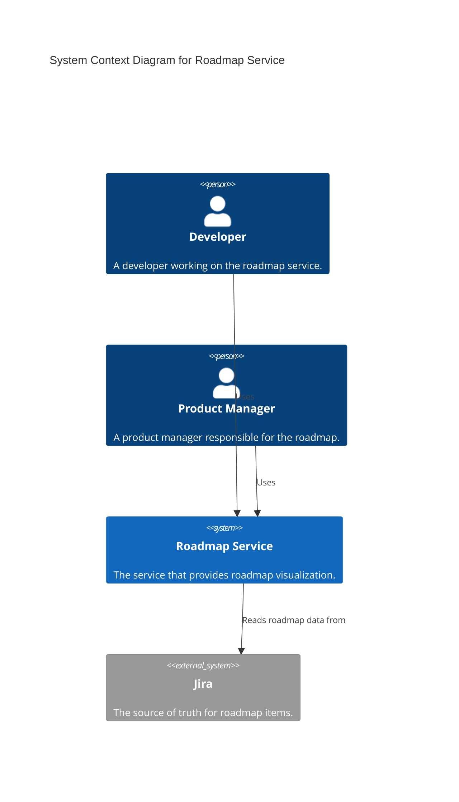

# C1: System Context

This document provides a high-level, C1 System Context view of the Roadmap Service, its users, and its interactions with external systems.

[Next: C2 Containers](./c2-containers.md)

