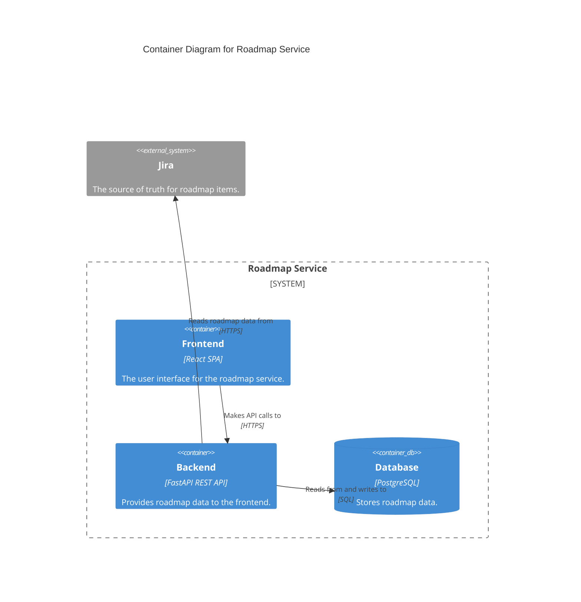

# C2: Containers

This document provides a C2 Container view of the Roadmap Service, illustrating the high-level technical containers that make up the system.

[Previous: C1 System Context](./c1-context.md) | [Next: C3 Components (Backend)](./c3-components-backend.md) | [Next: C3 Components (Frontend)](./c3-components-frontend.md)

