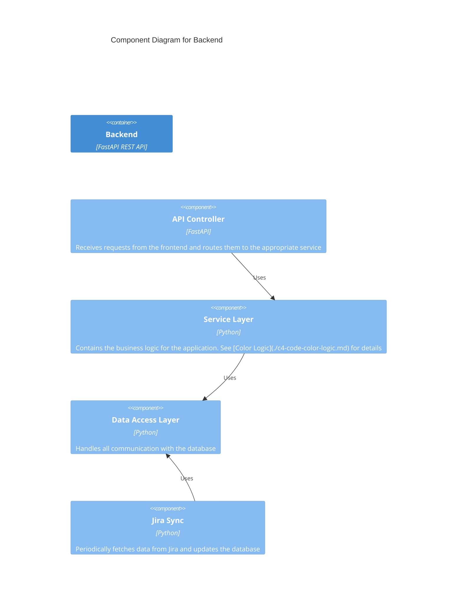

# C3: Backend Components

This document provides a C3 Component view of the Backend container, detailing its internal modules and their responsibilities.

[Previous: C2 Containers](./c2-containers.md)

## Components

The Backend container consists of the following components:

- **API Endpoints**: Exposes the REST API for the frontend. This includes endpoints for fetching roadmap data and checking the status of the Jira sync.
- **Jira Sync Service**: A background service responsible for fetching data from the Jira API.
- **Data Processing Service**: A service that transforms the raw Jira data into the format required by the frontend, including applying the color logic.
- **Database Module**: Handles all interactions with the PostgreSQL database.

## Data Flow

1.  The **Jira Sync Service** fetches raw data from the Jira API and stores it in the `jira_issue_raw` table.
2.  The **Data Processing Service** reads the raw data, applies the business logic (e.g., color calculation), and stores the processed data in the `roadmap_item` table.
3.  The **API Endpoints** serve the processed data from the `roadmap_item` table to the frontend.
