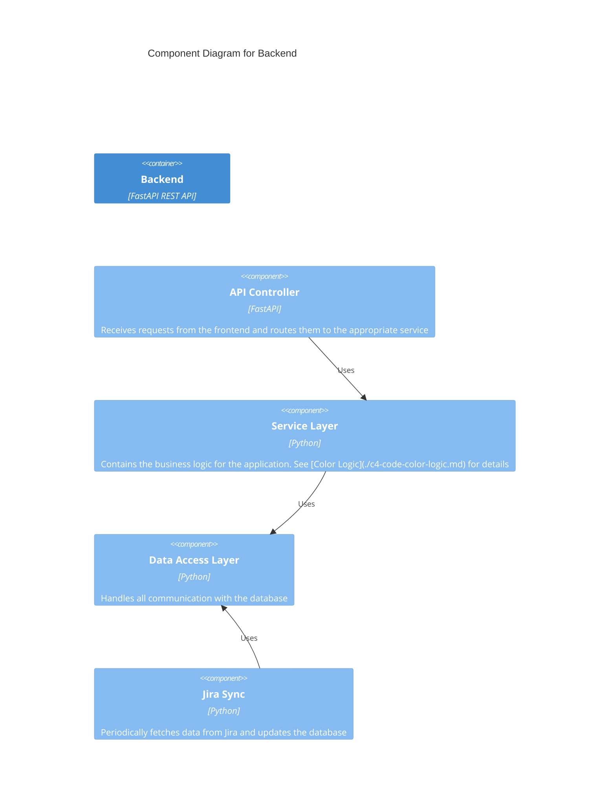

# C3: Backend Components

This document provides a C3 Component view of the Backend container, detailing its internal modules and their responsibilities.

[Previous: C2 Containers](./c2-containers.md)

