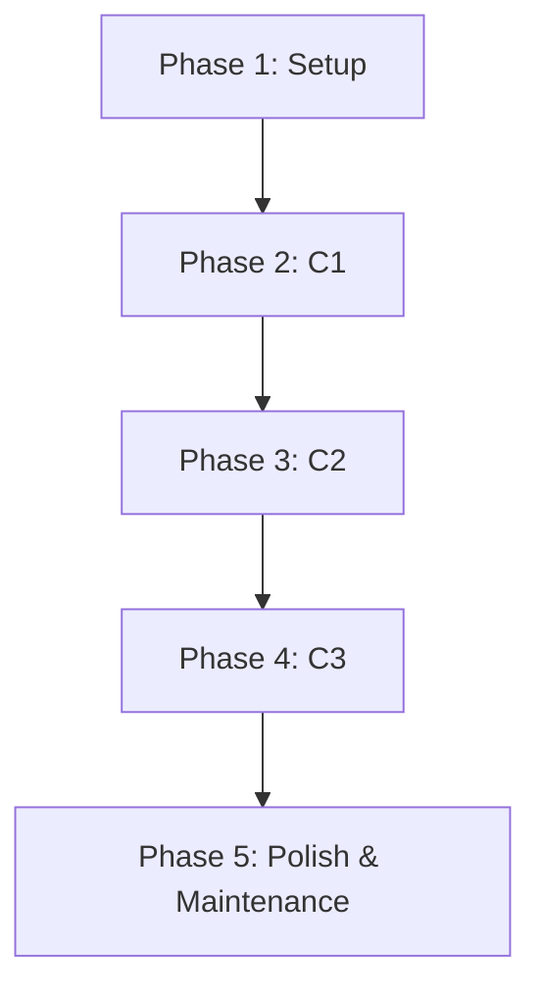

# Tasks: Project Architecture Documentation

This document outlines the tasks required to create and maintain the project architecture documentation using the C4 model.

## Phase 1: Setup

These tasks prepare the foundational directory structure for the documentation.

| ID | Task | File(s) |
|---|---|---|
| [X] T001 | Create the directory structure for the architecture documentation. | `docs/architecture/` |

---
**Checkpoint**: The `docs/architecture` directory exists and is ready for content.

## Phase 2: C1 - System Context

**Goal**: Create the System Context diagram and documentation to provide a high-level overview of the system, its users, and its interactions with external systems.

| ID | Task | File(s) |
|---|---|---|
| [X] T002 | [US1] Create the C1 System Context document. | `docs/architecture/c1-context.md` |
| [X] T003 | [US1] Write the explanatory text for the System Context. | `docs/architecture/c1-context.md` |
| [X] T004 | [US1] Create the Mermaid.js C4 Context diagram showing users (Developer, Product Manager) and the external Jira system. | `docs/architecture/c1-context.md` |

---
**Checkpoint**: `c1-context.md` is complete and accurately reflects the system's context.

## Phase 3: C2 - Containers

**Goal**: Create the Container diagram and documentation to show the high-level technical containers (frontend, backend, database).

| ID | Task | File(s) |
|---|---|---|
| [X] T005 | [US2] Create the C2 Containers document. | `docs/architecture/c2-containers.md` |
| [X] T006 | [US2] Write the explanatory text for the containers. | `docs/architecture/c2-containers.md` |
| [X] T007 | [US2] Create the Mermaid.js C4 Container diagram illustrating the Frontend (React), Backend (FastAPI), and Database (PostgreSQL). | `docs/architecture/c2-containers.md` |

---
**Checkpoint**: `c2-containers.md` is complete and accurately shows the high-level technical containers.

## Phase 4: C3 - Components

**Goal**: Create the Component diagrams and documentation to detail the internal modules of the frontend and backend.

| ID | Task | File(s) |
|---|---|---|
| [X] T008 | [US3] [P] Create the C3 Backend Components document. | `docs/architecture/c3-components-backend.md` |
| [X] T009 | [US3] [P] Create the C3 Frontend Components document. | `docs/architecture/c3-components-frontend.md` |
| [X] T010 | [US3] Write the explanatory text for the backend components (API, Services, Jira Sync). | `docs/architecture/c3-components-backend.md` |
| [X] T011 | [US3] Write the explanatory text for the frontend components (Pages, UI Components, API service). | `docs/architecture/c3-components-frontend.md` |
| [X] T012 | [US3] Create the Mermaid.js C4 Component diagram for the backend. | `docs/architecture/c3-components-backend.md` |
| [X] T013 | [US3] Create the Mermaid.js C4 Component diagram for the frontend. | `docs/architecture/c3-components-frontend.md` |

---
**Checkpoint**: Component documents for both frontend and backend are complete.

## Phase 5: Polish & Maintenance

**Goal**: Finalize the documentation and implement measures to keep it up-to-date.

| ID | Task | File(s) |
|---|---|---|
| [X] T014 | [US4] Implement a pre-merge pipeline check (e.g., GitHub Action) that requires a manual checkbox confirmation that architecture documentation has been updated. | `.github/workflows/pr-docs-check.yml` |
| [X] T015 | [US4] Add internal links between the C4 documents to improve navigation. | `docs/architecture/*.md` |
| [X] T016 | [US4] Review all documentation for clarity, consistency, and accuracy. | `docs/architecture/*.md` |

---
**Checkpoint**: Documentation is fully polished, and the maintenance process is in place.

## Dependencies

The phases should be completed in order, as each level of the C4 model builds upon the previous one.

## Parallel Execution

Within Phase 4, the work on the frontend and backend component diagrams can be done in parallel:
- **Developer A**: Can work on `T008`, `T010`, `T012` (Backend documentation).
- **Developer B**: Can work on `T009`, `T011`, `T013` (Frontend documentation).

## Implementation Strategy

The implementation will follow the phases outlined above. The MVP (Minimum Viable Product) for this feature would be the completion of **Phase 1, 2, and 3**, as this provides the most critical high-level architectural overview. The remaining phases can be completed as a fast-follow.
